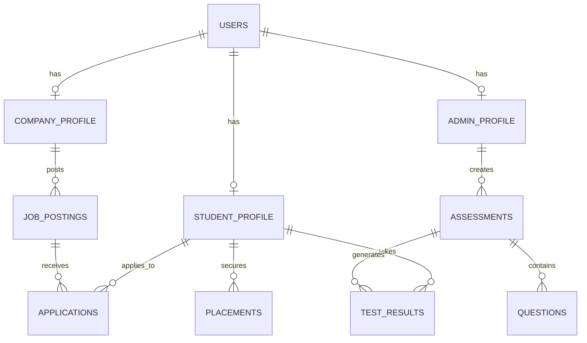
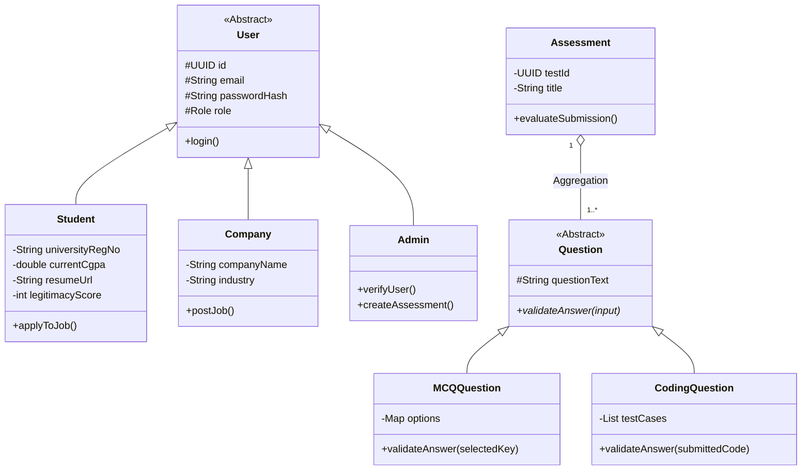

# 🎓 GradPlacifyr (Campus Placement Management System)

> A comprehensive, full-stack web application designed to streamline the campus placement process for Students, Training & Placement Officers (TPOs), and Company Recruiters.

---

## 📖 Description
GradPlacifyr is a centralized portal that bridges the gap between university administration, students, and hiring companies. It moves beyond a simple CRUD job board by integrating AI-driven profile building, an internal assessment engine with anti-cheating mechanisms, and robust role-based access control to ensure a transparent, fair, and efficient hiring drive.

## ❗ Problem Statement
The traditional college placement process is often fragmented, relying on spreadsheets, scattered emails, and manual tracking. 
* **For Students:** Difficult to track eligible companies, manage resumes, and prepare for specific roles.
* **For Colleges (TPOs):** Manual verification of student data, inability to seamlessly track off-campus offers, and lack of internal ranking to identify students needing help.
* **For Companies:** Sorting through unstandardized resumes and managing interview shortlists without a unified dashboard.

**GradPlacifyr solves this** by providing dedicated portals for each role, automating resume data extraction, and enforcing standardized communication.

---

## 🛠️ Technology Stack

### Current Implementation
* **Frontend:** React.js, TypeScript (`.tsx`), Vite, Tailwind CSS (via PostCSS)
* **Backend:** Node.js, Express.js
* **Database:** PostgreSQL (Relational data: Users, Jobs, Applications)
* **Authentication:** JWT (JSON Web Tokens) with Role-Based Access Control (RBAC)

### Planned / Upcoming Integrations
* **Database Extension:** MongoDB (NoSQL) for unstructured data (AI Resume parsing JSONs, Test Logs).
* **AI Services:** Gemini 1.5 API (for Automated Resume Parsing and AI Prep Assistant).
* **Code Execution:** Judge0 API / Piston (for secure, sandboxed coding assessments).

---

## ⚙️ Requirements

### Functional Requirements
* **Student Portal:**
  * Auto-fill profile via AI Resume PDF Parsing.
  * One-click apply to eligible jobs based on CGPA and branch criteria.
  * Track application status and report external/off-campus offers.
  * Take college-assigned assessments (MCQs & Coding).
* **Company / Recruiter Portal:**
  * Self-registration and company profile management.
  * Post jobs with specific eligibility filters.
  * Review applicants, download resumes, and update hiring statuses.
* **Admin (TPO) Portal:**
  * Verify student and company registrations.
  * Create Assessment Drives to calculate an internal "Legitimacy Score".
  * Monitor real-time placement analytics and application flows.

### Non-Functional Requirements
* **Scalability:** System must handle concurrent assessment submissions (e.g., 500 students taking a test simultaneously).
* **Security:** Strict separation of data. Companies must *not* have access to the internal university "Legitimacy Score". Code execution must run in isolated sandboxes.
* **Integrity:** Anti-cheating mechanisms during assessments, including tab-switch detection and time-bound submissions.
* **Performance:** AI resume parsing must complete under 10 seconds.

---

## 📂 Repository Structure

The project is structured as a Monorepo containing separate client and server applications.

```text
Placement-Portal/
├── placement-portal-frontend/      # React/Vite Client
│   ├── public/                     # Static assets (SVGs, Logos)
│   ├── src/
│   │   ├── api/                    # Axios API client & endpoints (auth, jobs, profile)
│   │   ├── assets/                 # App images and global CSS
│   │   ├── components/             # Reusable UI (Layouts, Protected Routes)
│   │   ├── context/                # Global State (AuthContext)
│   │   ├── pages/                  # Route-level components
│   │   │   ├── admin/              # TPO/Admin Dashboards
│   │   │   ├── auth/               # Login, Register, Role Selection
│   │   │   ├── company/            # Recruiter Dashboards & Job Posting
│   │   │   └── student/            # Student Dashboard, Profile, Job Board
│   │   ├── App.tsx                 # Root Router
│   │   └── main.tsx                # React DOM render entry
│   ├── vite.config.ts              
│   └── package.json                
│
└── placement-portal-backend/       # Node.js/Express Server
    ├── scripts/                    # Database migration & init scripts (init-db.sql)
    ├── src/
    │   ├── db/                     # PostgreSQL Connection config
    │   ├── middleware/             # Auth guards, Error handlers, Async wrappers
    │   ├── routes/                 # Express API Routes (auth, users, jobs, ai, applications)
    │   ├── utils/                  # AppError classes and utilities
    │   └── server.js               # Entry point
    ├── .env.example                # Environment variables template
    └── package.json                

```

---

## 🏛️ System Architecture & Design

### Entity Relationship Diagram (ERD)

*Maps the relational data structure across the three main domains: Users, Jobs, and Assessments.*



### Core Class Architecture (Domain Model)

*Demonstrates the Object-Oriented design, highlighting Inheritance (Users) and Polymorphism (Questions) for scalable feature expansion.*



---

## 🚀 Getting Started

### Prerequisites

* Node.js (v18+ recommended)
* PostgreSQL installed and running locally.

### Backend Setup

1. Navigate to the backend directory:
```bash
cd placement-portal-backend

```


2. Install dependencies:
```bash
npm install

```


3. Set up environment variables:
* Copy `.env.example` to `.env` and fill in your DB credentials, JWT Secret, and Port.


4. Initialize the Database:
* Run the SQL scripts provided in `/scripts/init-db.sql` in your Postgres GUI (pgAdmin/DBeaver) or CLI.


5. Start the server:
```bash
npm run dev

```


### Frontend Setup

1. Navigate to the frontend directory:
```bash
cd placement-portal-frontend

```


2. Install dependencies:
```bash
npm install

```


3. Start the Vite development server:
```bash
npm run dev

```


---

*Designed and built for modern campus placements.*
